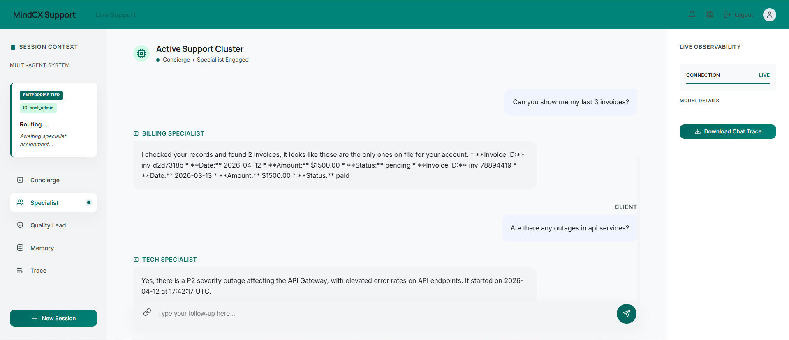
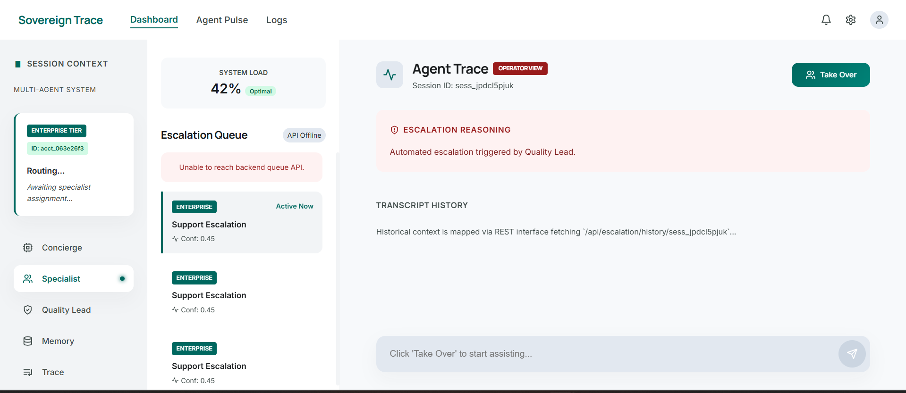

# MindCX
[](https://github.com/USERNAME/mindcx/actions/workflows/ci.yml)

The most frustrating part of customer support is having to explain your problem all over again.

MindCX is a multi-agent support system that actually remembers its users. It uses three layers of memory across the current conversation, the current session, and the full user history. 

---

## The Problem It Solves

Most support systems struggle to survive real-world production. Three problems come up repeatedly:

* **Context Rot:** 
Without tiered memory, agents either forget past conversations or stuff the context window with irrelevant history, which degrades response quality and forces users to re-explain themselves on every return visit.

* **Unchecked Autonomy:** 
Single-agent systems have no internal check on their own output. Without a supervisor, an agent can confidently execute the wrong fix or trigger billing actions it shouldn't.

* **The Persistence Gap:** 
Most frameworks handle the "current turn" well but fail to recall user-specific facts across different sessions. The result is a support experience that feels like starting from scratch every time.

The real engineering is in the memory layer. Turn context, session summaries, and long-term vector memory run in parallel so the system never loses track of a user across conversations.

---

## Architecture Validation & Latest Eval Results

MindCX maintains strict multi-agent orchestration by funneling isolated, deterministic routing capabilities into the LLMs instead of letting them roam dynamically. Through our 3-tier memory retention structure (Turn, Session, and Global Vector), context limits are respected while delivering 100% routing accuracy within the offline evaluation suite.

**Latest Eval Harness Artifact:**
```text
============================================================
 MINDCX OFFLINE EVALUATION REPORT
============================================================
ID                   | STATUS     | ACTUAL              
------------------------------------------------------------
billing_simple       | PASS       | billing_specialist (resolved)
tech_outage          | PASS       | tech_specialist (resolved)
greeting_fast_pass   | PASS       | tech_specialist (resolved)
escalation_manual    | PASS       | escalate (escalate) 
billing_free_tier    | PASS       | billing_specialist (resolved)
tech_bug_pro         | PASS       | tech_specialist (resolved)
------------------------------------------------------------
OVERALL ACCURACY: 100.00%
RETRY RATE:       0.00 per turn
============================================================
```

---

## How It Works

**Three-Tier Memory Architecture:**
* **The Conversation (Short-Term)**
It keeps the agents focused on the current conversation thread so they don't lose their place between messages.
* **The Session (Mid-Term)**
If a user leaves and returns an hour later, the system uses a Redis-backed summary to pick up exactly where they left off without needing a full recap.
* **The History (Long-Term)**
Using Vector Search, the system remembers past issues and preferences from weeks or months ago. If a user says, "It’s happening again," the agents can recall exactly how it was fixed last time.

**Self-Correcting Quality Loop:** 
Every specialist response must pass a "Quality Lead" supervisor node before reaching the user. If the response hallucinates or misses the user's actual question, the Quality Lead issues a `RETRY` and the graph loops back. A hard cap of 2 retries prevents runaway token burn.

**Taint-and-Suppress Context Isolation:**
If an AI session fails and escalates to a human, we "taint" the cross-session state note with an `[ESCALATED]` prefix. On the user's next visit, the system detects this prefix and suppresses the context, preventing a degraded or confusing previous session from poisoning the new LLM context window.

**Two-Layer Caching:**
During a retry loop, tool calls would otherwise re-execute and burn tokens on data already fetched. Caching results in both GraphState (turn-local) and Redis SessionData (cross-turn) prevents that.

**Performance & Cost Optimization**
* **Regex Fast-Pass:** Simple inputs like greetings are caught by a regex check before hitting the LLM. This bypasses the LLM entirely, saving a round-trip on approximately 40% of message exchanges.
* **Token Budgeting:** Large tool payloads, such as extensive billing histories, pass through a budget filter. If a payload is too large, it gets trimmed before reaching the LLM.
* **Model Tiering:** Tasks are routed to the most cost-effective model possible. Lightweight models handle initial triage, while premium reasoning models are reserved exclusively for the Quality Lead supervisor.

**LLM Observability**
* **Tracing:** Every LLM call, tool execution, and routing decision is traced via Langfuse.
* **Metric Attribution:** Every trace captures token consumption, latency, and cost. Traces are tagged by user tier and session ID, so cost and latency can be attributed per user.

---

## Screenshots

**Customer Chat — Billing & Tech Specialists in action**


**Agent Portal — Escalation queue with human takeover**



---

## The Architecture DAG

The graph is compiled via StateGraph and runs as an async streaming pipeline. Every LLM invocation, tool call, and routing decision flows back to the React client as WebSocket events.

```
User ──WebSocket──▶ Concierge ──intent──▶ Billing Specialist
                                    └────▶ Tech Specialist
                                                │
                                          Quality Lead
                                         ╱     │      ╲
                                      PASS   RETRY   ESCALATE
                                       │       │        │
                                      END    re-run   FIFO Queue ──▶ Human Agent
```

---

## Project Structure

```
backend/
├── agent/
│   ├── graph.py          # LangGraph DAG: concierge → specialists → quality lead
│   ├── memory.py         # Embedding-based semantic memory (search + add + prune)
│   ├── summarization.py  # Cross-session state note generation with conflict reconciliation
│   └── context.py        # Builds the 5-section context window for every LLM call
├── api/
│   ├── websocket.py      # WebSocket endpoint with astream_events, Langfuse tracing
│   └── escalation.py     # HITL queue, takeover, agent messaging, session resolution
├── llm/
│   └── client_factory.py # Provider-agnostic LLM initialization (Gemini/OpenAI/Anthropic)
├── session/
│   └── manager.py        # Redis session CRUD, state note taint/suppress, stale ID pruning
└── db/
    └── models.py         # SQLAlchemy models: Account, Billing, Outage, Memory (embeddings)

frontend/                  # React + TypeScript (Vite MPA)
├── src/
│   ├── App.tsx            # Customer portal entry
│   ├── AgentApp.tsx       # Agent portal entry (RBAC-gated)
│   ├── pages/
│   │   ├── ChatView.tsx   # Real-time chat with live observability sidebar + trace export
│   │   ├── EscalationDashboard.tsx  # FIFO queue viewer, takeover controls, agent reply
│   │   └── LogsView.tsx   # Session browser with routing trace + full transcript replay
```
---

## Stack

| Layer | Tech |
|---|---|
| Orchestration | LangGraph `StateGraph`, LangChain Core |
| LLMs | Gemini (default), OpenAI, Anthropic — hot-swappable via YAML config |
| Embeddings | `gemini-embedding-001` / OpenAI embeddings |
| Backend | FastAPI, WebSockets, Pydantic v2 |
| State | Redis (sessions, locks, escalation queue, state notes) |
| Storage | SQLite + SQLAlchemy (accounts, vector memories) |
| Observability | Langfuse (Graph tracing, token usage, latency metrics) |
| Frontend | React 18, TypeScript, Vite MPA |

---

## Running It

```bash
cp backend/config/.env.example backend/config/.env
# Add your LLM_API_KEY

docker-compose up --build
```

**Access Points:**
*   Customer chat: `http://localhost:5173`
*   Agent portal:  `http://localhost:5173/agent.html`